# RTL Design & Verification - Complete Environment Setup Guide

A production-grade guide to setting up a Linux development environment for RTL Digital Design and Verification. Supports **WSL2**, **VMware Workstation**, and **Native or Dual-Boot**.

---

## Toolkit Overview

| Tool / Component                  | Purpose                                                                                              |
| :-------------------------------- | :--------------------------------------------------------------------------------------------------- |
| **WSL2**                          | Windows Subsystem for Linux - lightweight Linux environment on Windows with seamless GUI integration |
| **VMware Workstation Pro**        | Full virtual machine isolation with dedicated resources for Linux development                        |
| **Ubuntu 22.04 LTS**              | Stable Long-Term Support Linux distribution used as the base OS                                      |
| **AMD Vivado ML Standard 2024.2** | AMD's commercial FPGA design and simulation suite (xsim, xvlog, xelab)                               |
| **iverilog**                      | Open-source Verilog / SystemVerilog simulator (Icarus Verilog)                                       |
| **gtkwave**                       | Open-source VCD waveform viewer for simulation debug                                                 |
| **verilator**                     | Fast open-source Verilog / SystemVerilog linter and cycle-accurate simulator                         |
| **VS Code**                       | Lightweight, extensible code editor with remote development support                                  |

---

## Table of Contents

- [RTL Design \& Verification - Complete Environment Setup Guide](#rtl-design--verification---complete-environment-setup-guide)
  - [Toolkit Overview](#toolkit-overview)
  - [Table of Contents](#table-of-contents)
  - [Part 1: Choosing Your Linux Platform](#part-1-choosing-your-linux-platform)
  - [Part 2: Platform Deployment](#part-2-platform-deployment)
    - [Option A: WSL2 Deployment (Recommended)](#option-a-wsl2-deployment-recommended)
      - [Step 1: Enable Windows Virtualization Subsystems via DISM](#step-1-enable-windows-virtualization-subsystems-via-dism)
      - [Step 2: System Reboot (Mandatory)](#step-2-system-reboot-mandatory)
      - [Step 3: Install WSL Core \& Ubuntu 22.04 LTS](#step-3-install-wsl-core--ubuntu-2204-lts)
      - [Step 4: Initialize Shell \& Verify Graphics Pipeline (WSLg)](#step-4-initialize-shell--verify-graphics-pipeline-wslg)
    - [Option B: VMware Workstation Deployment](#option-b-vmware-workstation-deployment)
    - [Option C: Native/Dual-Boot Deployment](#option-c-nativedual-boot-deployment)
  - [Part 3: Toolchain Installation](#part-3-toolchain-installation)
    - [Step 1: Base System Update \& Build Tools](#step-1-base-system-update--build-tools)
    - [Step 2: Open-Source EDA Tools](#step-2-open-source-eda-tools)
    - [Step 3: AMD Vivado ML Standard](#step-3-amd-vivado-ml-standard)
  - [Part 4: Environment Setup](#part-4-environment-setup)
  - [](#)
  - [Part 5: Visual Studio Code](#part-5-visual-studio-code)
    - [**WSL2 Users ONLY:**](#wsl2-users-only)
    - [**Other Linux Users**](#other-linux-users)
  - [Part 6: VS Code Configuration](#part-6-vs-code-configuration)
    - [Required Extensions](#required-extensions)
  - [Part 7: Verible Formatter](#part-7-verible-formatter)
    - [Formatter Settings](#formatter-settings)
  - [Part 8: Secure GitHub Setup](#part-8-secure-github-setup)
  - [Part 9: Verification Smoke Test](#part-9-verification-smoke-test)
    - [Step 1: Create Test Files](#step-1-create-test-files)
    - [Step 2: Run Verification Workflow](#step-2-run-verification-workflow)
    - [Step 3: View Waveforms](#step-3-view-waveforms)
  - [Quick Reference Links](#quick-reference-links)
  - [Troubleshooting \& Known Fixes](#troubleshooting--known-fixes)
    - [Issue 1: Vivado Simulator (`xvlog`, `xelab`, `xsim`) Crashes with `std::runtime_error: locale`](#issue-1-vivado-simulator-xvlog-xelab-xsim-crashes-with-stdruntime_error-locale)
      - [Symptoms](#symptoms)
      - [Cause](#cause)
      - [Fix](#fix)
    - [Issue 2: `chmod: changing permissions: Operation not permitted` on Windows Drives](#issue-2-chmod-changing-permissions-operation-not-permitted-on-windows-drives)
      - [Symptoms](#symptoms-1)
      - [Cause](#cause-1)
      - [Fix](#fix-1)
    - [Issue 3: VS Code `Exec format error` in WSL2](#issue-3-vs-code-exec-format-error-in-wsl2)
      - [Step 1: Re-register the WSL Interop Service](#step-1-re-register-the-wsl-interop-service)
      - [Step 2: Make the Fix Permanent (If Step 1 loses connection later)](#step-2-make-the-fix-permanent-if-step-1-loses-connection-later)
      - [Step 3: Full WSL Shutdown (Fallback)](#step-3-full-wsl-shutdown-fallback)
      - [Quick One-Liner (Emergency Fix)](#quick-one-liner-emergency-fix)
  - [Totally, Completely, Utterly OPTIONAL Nerdy Environment Setup](#totally-completely-utterly-optional-nerdy-environment-setup)
    - [Setup Goal](#setup-goal)
    - [1. Update Ubuntu](#1-update-ubuntu)
    - [2. Install Base Packages](#2-install-base-packages)
    - [3. Install Starship](#3-install-starship)
    - [4. Install eza](#4-install-eza)
    - [5. Install zoxide](#5-install-zoxide)
    - [6. Install fzf](#6-install-fzf)
    - [7. Install bat](#7-install-bat)
    - [8. Git Configuration](#8-git-configuration)
    - [Fonts](#fonts)
    - [Cascadia Code](#cascadia-code)
    - [JetBrains Mono Nerd Font](#jetbrains-mono-nerd-font)
    - [Recommended VS Code Extensions](#recommended-vs-code-extensions)
    - [Disable VS Code Restricted Mode (Optional)](#disable-vs-code-restricted-mode-optional)
    - [Useful Bash Aliases](#useful-bash-aliases)
    - [Add all aliases](#add-all-aliases)

---

## Part 1: Choosing Your Linux Platform

| Method                 | Setup Complexity | Best Used For                                                                     |
| ---------------------- | ---------------- | --------------------------------------------------------------------------------- |
| **WSL2 (Recommended)** | Low              | Fastest setup, lowest RAM usage, seamless VS Code & GUI (WSLg) integration        |
| **VMware Workstation** | Medium           | Complete VM isolation, dedicated virtual disk, traditional desktop GUI            |
| **Dual-Boot Ubuntu**   | High             | Direct hardware access, dedicated physical lab setup, physical FPGA JTAG bring-up |
| **Native Ubuntu**      | High             | Direct hardware access, dedicated physical lab setup, physical FPGA JTAG bring-up |

---

## Part 2: Platform Deployment

Choose **One** deployment pathway below.

### Option A: WSL2 Deployment (Recommended)

#### Step 1: Enable Windows Virtualization Subsystems via DISM

Open **PowerShell as Administrator** and run:

```powershell
dism /online /enable-feature /featurename:Microsoft-Windows-Subsystem-Linux /all /norestart
dism /online /enable-feature /featurename:VirtualMachinePlatform /all /norestart
```

#### Step 2: System Reboot (Mandatory)

#### Step 3: Install WSL Core & Ubuntu 22.04 LTS

After rebooting, open **PowerShell as Administrator** and run:

```powershell
# Download and register WSL Ubuntu 22.04 LTS
wsl --install -d Ubuntu-22.04
```

**Set your UNIX username and password when prompted**

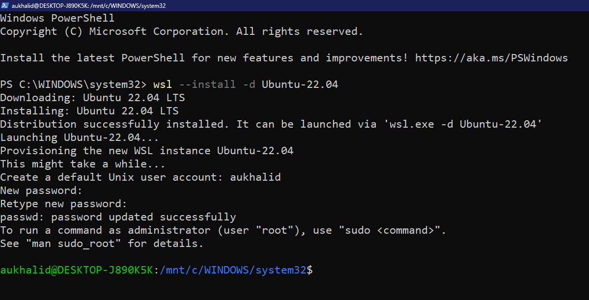

> **Alternative:** If PowerShell encounters network limits, open the Microsoft Store app, search for **Ubuntu 22.04 LTS**, and click **Get / Install**.

#### Step 4: Initialize Shell & Verify Graphics Pipeline (WSLg)

1. Launch **Ubuntu 22.04 LTS** from the **Windows Start** Menu.

   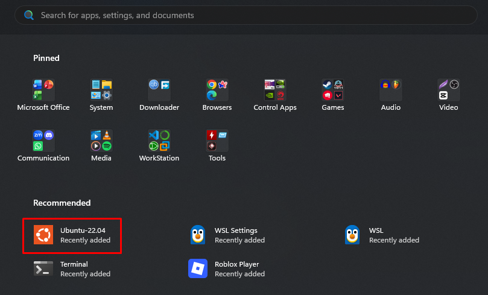

2. Test Windows GUI app integration:

```bash
sudo apt update && sudo apt install -y x11-apps
xclock
```

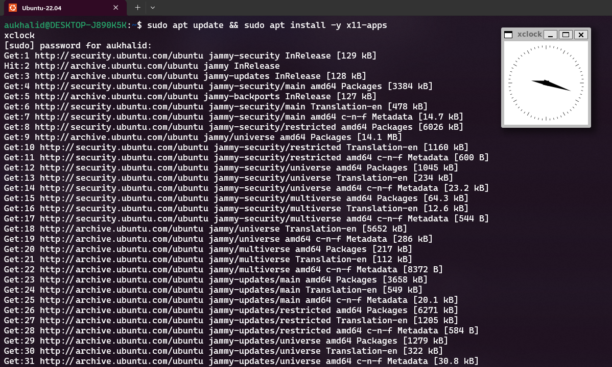

> A small analog clock window should open natively on your Windows desktop.

### Option B: VMware Workstation Deployment

1. Download [**VMware Workstation Pro**](https://www.techpowerup.com/download/vmware-workstation-pro/) and the [**Ubuntu 22.04.5 LTS ISO**](https://releases.ubuntu.com/22.04/).
2. Create a new VM with:
   - **CPU Cores**: 4 minimum (6+ recommended)
   - **RAM**: 8 GB minimum (12–16 GB recommended)
   - **Disk Space**: 120–150 GB (Single File allocation)

### Option C: Native/Dual-Boot Deployment

1. Create an Ubuntu Live USB using [**Rufus**](https://rufus.ie/en/) and the [**Ubuntu 22.04.5 LTS ISO**](https://releases.ubuntu.com/22.04/).
2. Shrink your Windows partition by at least **120 GB** in Windows Disk Management.
3. Boot into BIOS/UEFI, **disable Secure Boot**, boot from the USB drive, and complete the dual-boot installation alongside Windows.

---

## Part 3: Toolchain Installation

Execute all subsequent steps inside your **Ubuntu 22.04 LTS terminal**.

### Step 1: Base System Update & Build Tools

```bash
# Update repository indexes
sudo apt update && sudo apt upgrade -y

# Essential build and networking utilities
sudo apt install -y build-essential gcc g++ make git git-lfs \
  python3 python3-pip lsb-release net-tools curl wget universal-ctags

# Legacy dependencies for Vivado & GUI rendering
sudo apt install -y libtinfo5 libncurses5 libncursesw5 libxrender1 \
  libxtst6 libxi6 libxft2 libfontconfig1 libx11-6 libxext6 libtinfo-dev
```

### Step 2: Open-Source EDA Tools

```bash
sudo apt install -y iverilog gtkwave verilator
```

### Step 3: AMD Vivado ML Standard

Skip if you are exclusively using Icarus Verilog (`iverilog`).

1. Download [**Vivado 2024.2 ML Standard Edition (Linux Web Installer)**](https://www.amd.com/en/support/downloads/adaptive-socs-and-fpgas/development-tools/2024-2.html) from AMD. Filename: `FPGAs_AdaptiveSoCs_Unified_2024.2_1113_2356_Lin64.bin`

   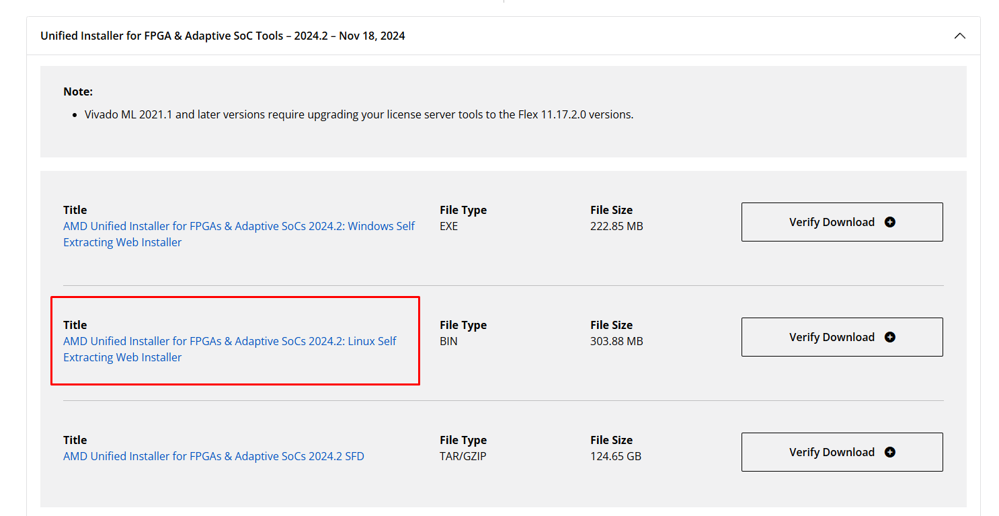

2. Prepare target directories and copy the installer into the native Linux filesystem (to prevent NTFS permission blocks):

```bash
# Create installation target path
sudo mkdir -p /tools/Xilinx
sudo chown -R $USER:$USER /tools/Xilinx

# Copy installer from Windows Downloads to Linux Home
mkdir -p downloads
```

2. Go to your Downloads folder destination on you Windows. Then copy the `FPGAs_AdaptiveSoCs_Unified_2024.2_1113_2356_Lin64.bin` file, and then go to **Linux > Ubuntu-22.04 > home > username > downloads** and paste it there

   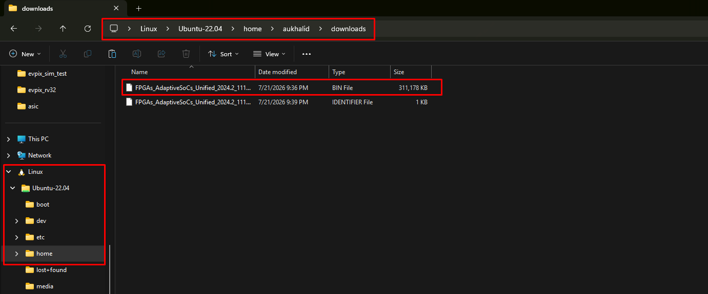

```bash
# Grant execution permissions and run
chmod +x FPGAs_AdaptiveSoCs_Unified_*.bin
./FPGAs_AdaptiveSoCs_Unified_*.bin
```

**Installer Settings:**

- Select **Vivado ML Standard**
- Uncheck everything that can be unchecked
- Select FPGA Parts if needed
- Set destination to `/tools/Xilinx`

  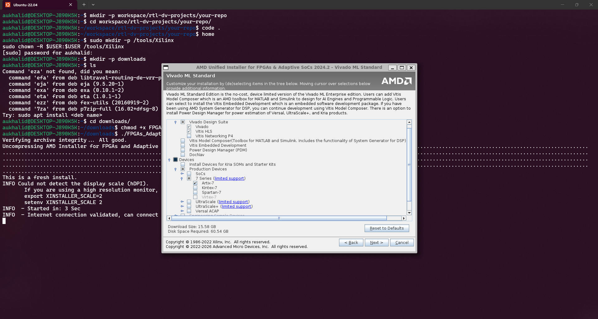

**Install Cable Drivers:**

```bash
cd /tools/Xilinx/Vivado/2024.2/data/xicom/cable_drivers/lin64/install_script/install_drivers/
sudo ./install_drivers
```

## Part 4: Environment Setup

Open `~/.bashrc`:

```bash
nano ~/.bashrc
```

Append the following to the bottom:

```bash
# ==============================================================================
# AMD Vivado 2024.2 & EDA Verification Toolchain Mapping Configuration
# ==============================================================================
source /tools/Xilinx/Vivado/2024.2/settings64.sh
alias vsim="vivado -mode gui &"

# ==============================================================================
# Short Aliases
# ==============================================================================
alias ivrun="iverilog -g2012"
```

Save and exit (Ctrl + O, Enter, Ctrl + X). Reload the bash engine parameters immediately:

```bash
source ~/.bashrc
```

## 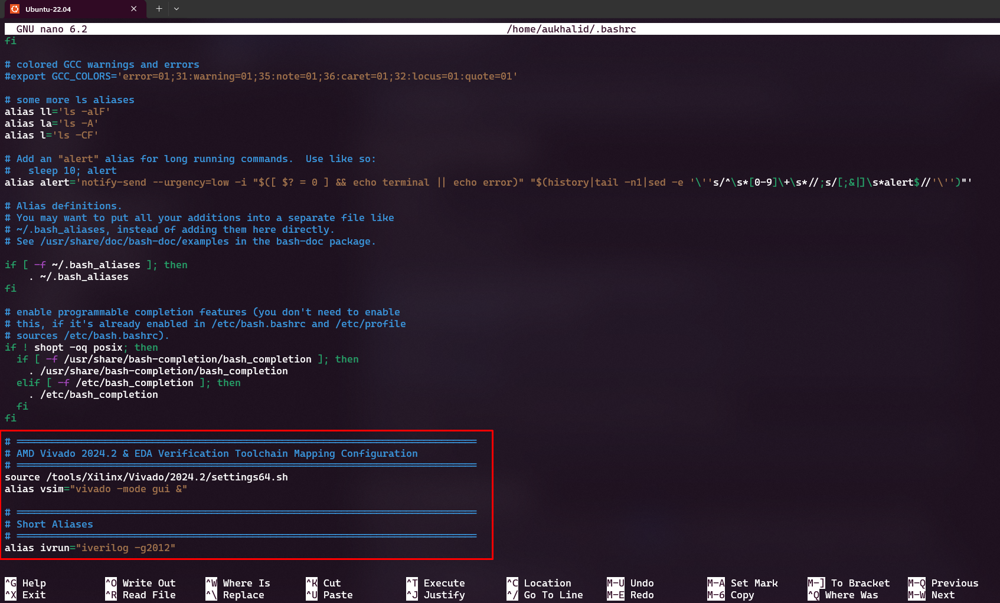

## Part 5: Visual Studio Code

### **WSL2 Users ONLY:**

> Download and install [**VS Code**](https://code.visualstudio.com/download?_exp_download=fb315fc982) on your **Windows host**.

> Install the **WSL extension** (`ms-vscode-remote.remote-wsl`) inside Windows VS Code.

> Click on **Get Started** and then **Connect to WSL using Distro**. Follow the Screenshots.

> 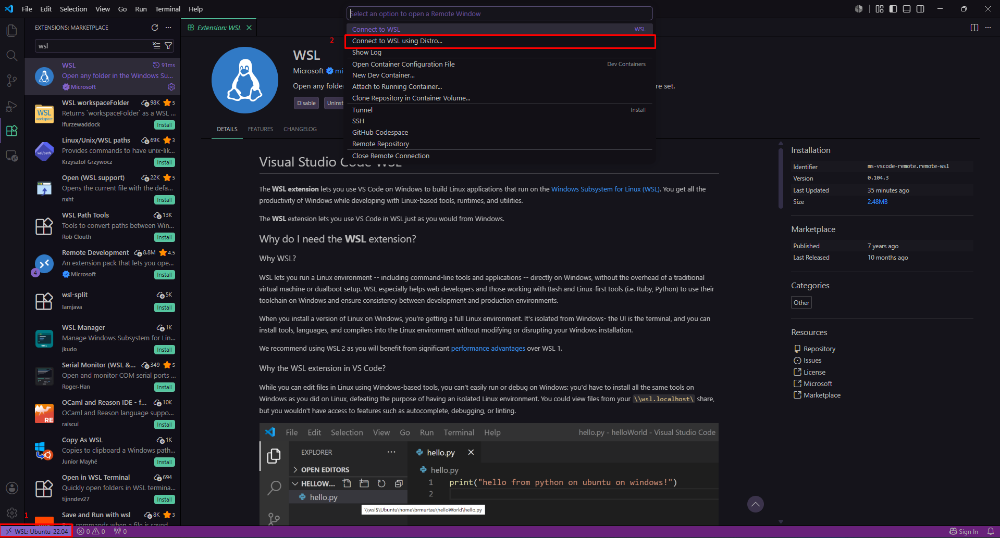
> 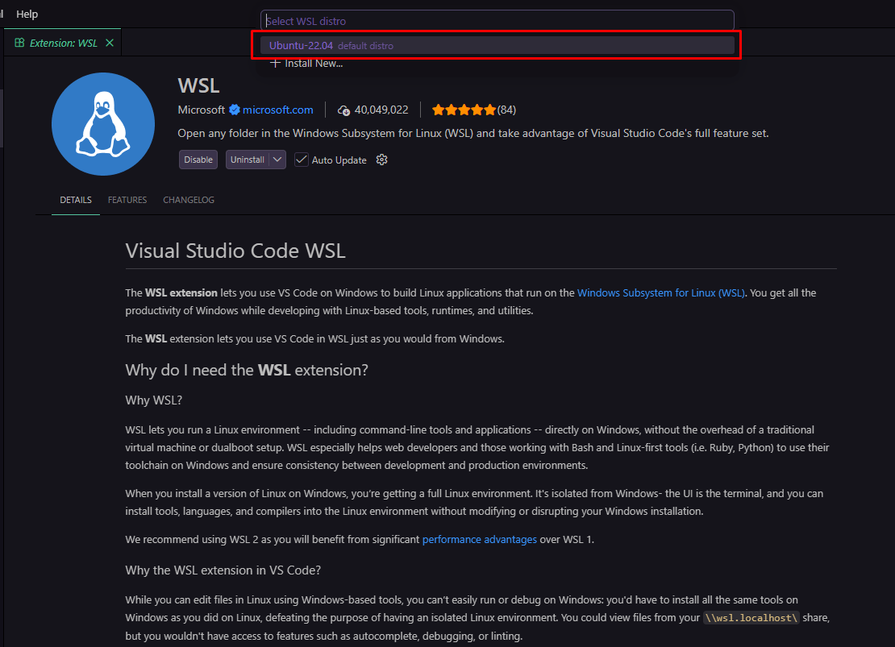

### **Other Linux Users**

```bash
# Clean conflicting legacy repos
sudo rm -f /etc/apt/sources.list.d/vscode.list

# Import Microsoft GPG key
wget -qO- https://packages.microsoft.com/keys/microsoft.asc | \
  gpg --dearmor | sudo tee /etc/apt/keyrings/packages.microsoft.gpg > /dev/null

# Register official repository
sudo sh -c 'echo "deb [arch=amd64,arm64,armhf signed-by=/etc/apt/keyrings/packages.microsoft.gpg] https://packages.microsoft.com/repos/code stable main" > /etc/apt/sources.list.d/vscode.list'

# Install VS Code
sudo apt update && sudo apt install -y code
```

## Part 6: VS Code Configuration

Launch VS Code in your workspace root:

```bash
mkdir -p workspace/rtl-dv-projects/your-repo
cd ~/workspace/rtl-dv-projects/your-repo
code .
```

### Required Extensions

Press `Ctrl + Shift + X` and install:

| Extension                        | Publisher        |
| -------------------------------- | ---------------- |
| SystemVerilog - Language Support | mshr-h           |
| Verilog-HDL/SystemVerilog        | LeafXia          |
| Verible                          | kukdh1           |
| Draw.io Integration              | henningdietrichs |
| vscode-icons                     | vscode-icons     |

---

## Part 7: Verible Formatter

```bash
mkdir -p downloads
cd ~/downloads

# Get the tag name for the latest Verible release
TAG=$(curl -s https://api.github.com/repos/chipsalliance/verible/releases/latest | grep '"tag_name":' | sed -E 's/.*"([^"]+)".*/\1/')

# Download the static x86_64 tarball for Linux
wget "https://github.com/chipsalliance/verible/releases/download/${TAG}/verible-${TAG}-linux-static-x86_64.tar.gz"

# Extract the archive
tar -xzf verible-*.tar.gz

# Find the extracted directory name and enter it
cd verible-*/

# Copy all Verible tools (formatter, linter, language server, etc.) to system PATH
sudo cp bin/* /usr/local/bin/

# Return home and clean up the download folder
cd ~
rm -rf ~/downloads/verible-*

# Verify installation
verible-verilog-format --version
```

### Formatter Settings

Open **User Settings (JSON)** (`Ctrl + Shift + P` → _Open User Settings (JSON)_)

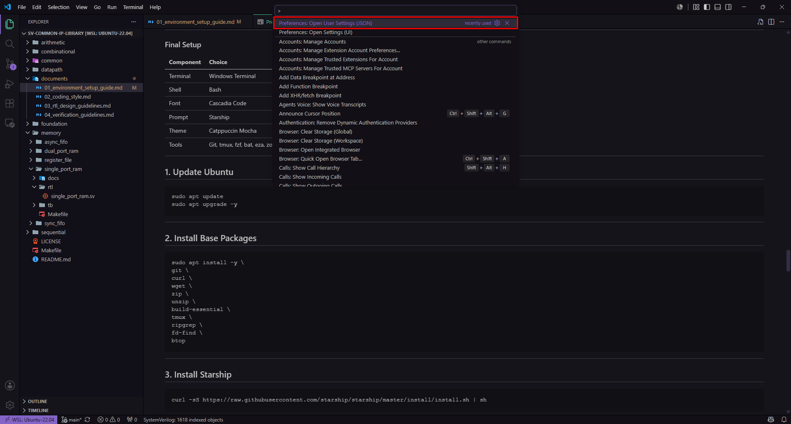

**Then add:**

```json
{
  "[systemverilog]": {
    "editor.defaultFormatter": "kukdh1.verible-formatter",
    "editor.formatOnSave": true
  },
  "verilog-formatter.path": "verible-verilog-format",
  "verilog-formatter.flagFile": ".verilog_format"
}
```

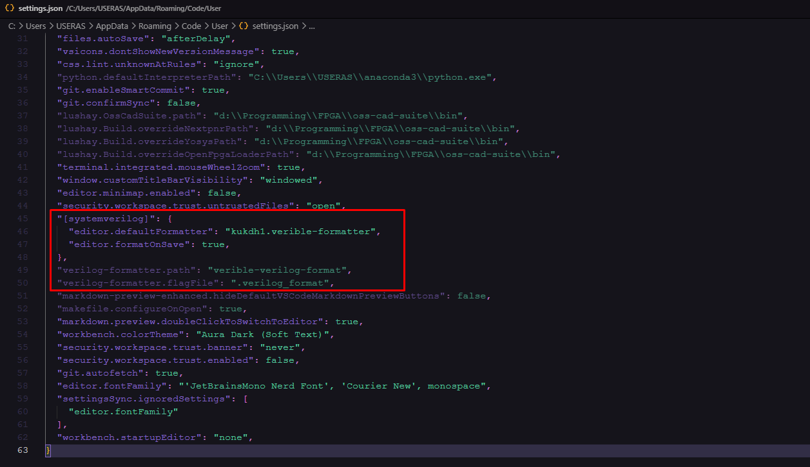

Create `.verilog_format` in your project root:

```
--column_limit 100
--indentation_spaces 2
--assignment_statement_alignment=align
--case_items_alignment=align
--port_declarations_alignment=align
--formal_parameters_alignment=align
```

---

## Part 8: Secure GitHub Setup

```bash
# 1. Configure identity
git config --global user.name "Your Name"
git config --global user.email "your.email@example.com"

# 2. Generate SSH Key
ssh-keygen -t ed25519 -C "your.email@example.com"

# 3. Print public key
cat ~/.ssh/id_ed25519.pub
```

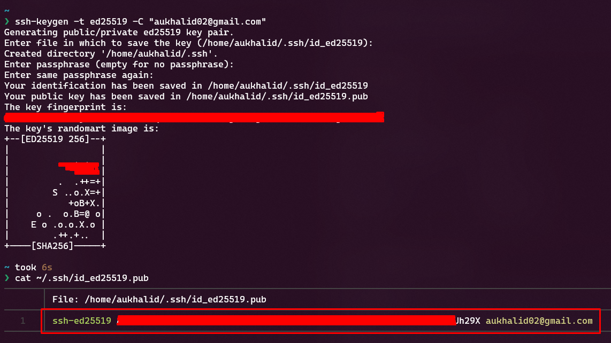

Copy the key and add it to **GitHub → Settings → SSH and GPG keys → New SSH Key**.

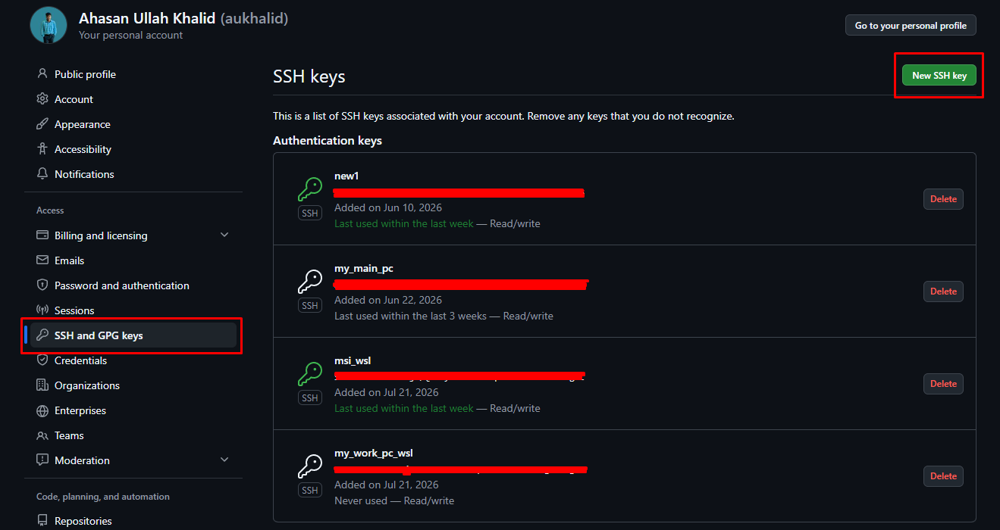
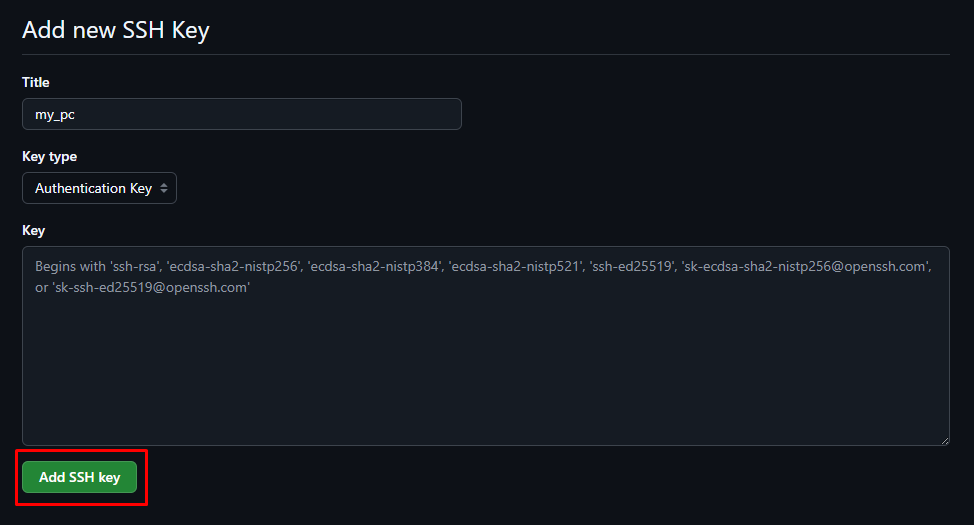

```bash
# 4. Verify connection
ssh -T git@github.com
```

---

## Part 9: FPGA Hardware Setup Guide

Follow this guide to enable USB pass-through from Windows to WSL2, allowing Vivado inside Linux to program your physical Artix-7 board via USB JTAG.

### Step 1: Install `usbipd-win` on Windows

1. Open **PowerShell as Administrator** in Windows.
2. Install the `usbipd` package using Windows Package Manager (`winget`):
   ```powershell
   winget install --exact --id dorssel.usbipd-win
   ```
3. Close the PowerShell window and **restart your computer**.

---

### Step 2: Install USBIP User-Space Tools inside WSL2 Ubuntu

Open your **Ubuntu WSL2 terminal** and execute:

```bash
# 1. Update package registry
sudo apt update

# 2. Install Linux USB utilities
sudo apt install -y linux-tools-virtual hwdata

# 3. Register the usbip binary location
sudo update-alternatives --install /usr/local/bin/usbip usbip $(ls /usr/lib/linux-tools/*/usbip | tail -n1) 20
```

---

## Part 10: Verification Smoke Test

### Step 1: Create Test Files

```bash
mkdir -p ~/workspace/rtl-dv-projects/smoke_test
cd ~/workspace/rtl-dv-projects/smoke_test
```

**`counter.sv`**:

```systemverilog
module counter #(
    parameter int WIDTH = 8
)(
    input  logic             clk_i,
    input  logic             rst_n_i,
    input  logic             wr_en_i,
    output logic [WIDTH-1:0] count_o
);
    always_ff @(posedge clk_i or negedge rst_n_i) begin
        if (!rst_n_i) begin
            count_o <= '0;
        end else if (wr_en_i) begin
            count_o <= count_o + 1'b1;
        end
    end
endmodule
```

**`counter_tb.sv`**:

```systemverilog
module counter_tb;
    logic clk = 0;
    logic rst_n = 0;
    logic wr_en = 0;
    logic [7:0] count;

    counter #(.WIDTH(8)) dut (
        .clk_i   (clk),
        .rst_n_i (rst_n),
        .wr_en_i (wr_en),
        .count_o (count)
    );

    always #5 clk = ~clk;

    initial begin
        $dumpfile("waveform.vcd");
        $dumpvars(0, counter_tb);
        #15 rst_n = 1;
        #10 wr_en = 1;
        repeat(20) @(posedge clk);
        $display("[SMOKE TEST SUCCESS] Counter final value: %d", count);
        $finish;
    end
endmodule
```

### Step 2: Unified Master Makefile

Save this file as `Makefile` in your project root directory (alongside `counter.sv` and `counter_tb.sv`).

```makefile
# ==============================================================================
# UNIFIED RTL & FPGA HARDWARE AUTOMATION MAKEFILE
# ==============================================================================
# Target Device : AMD/Xilinx Artix-7 (e.g., Basys 3 / Arty A7)
# Toolchain     : Verilator, Icarus Verilog, AMD Vivado Batch Mode
# Operating Env : WSL2 (Ubuntu 22.04 LTS)
# ==============================================================================

# ------------------------------------------------------------------------------
# PROJECT CONFIGURATION
# ------------------------------------------------------------------------------
TOP_RTL     ?= counter
TOP_TB      ?= counter_tb
FPGA_PART   ?= xc7a35tcpg236-1# Default: Digilent Basys 3 (Artix-7)

RTL_SRCS    := counter.sv
TB_SRCS     := counter_tb.sv
CONSTR_SRCS := constraints.xdc

BUILD_DIR   := build
OUT_BIT     := $(BUILD_DIR)/$(TOP_RTL).bit
SIM_BIN     := $(BUILD_DIR)/sim.out
WAVE_VCD    := waveform.vcd

# TCL Script Generation Targets
BUILD_TCL   := $(BUILD_DIR)/build_bitstream.tcl
PROGRAM_TCL := $(BUILD_DIR)/program_fpga.tcl

# ------------------------------------------------------------------------------
# DEFAULT TARGET
# ------------------------------------------------------------------------------
.PHONY: all
all: lint sim_iv

# ------------------------------------------------------------------------------
# 1. LINTING TARGETS
# ------------------------------------------------------------------------------
.PHONY: lint
lint: ## Run Verilator static code analysis
	@echo "=== [LINT] Running Verilator Static Analysis ==="
	@mkdir -p $(BUILD_DIR)
	verilator --lint-only -Wall $(RTL_SRCS)
	@echo "[LINT SUCCESS] No structural or logic warnings detected."

# ------------------------------------------------------------------------------
# 2. SIMULATION TARGETS
# ------------------------------------------------------------------------------
.PHONY: sim_iv sim_xsim sim_only waves

sim_iv: lint ## Compile & run simulation via Icarus Verilog (Fast Baseline)
	@echo "=== [SIM] Running Icarus Verilog Simulation ==="
	@mkdir -p $(BUILD_DIR)
	iverilog -g2012 -o $(SIM_BIN) $(RTL_SRCS) $(TB_SRCS)
	vvp $(SIM_BIN)

sim_xsim: lint ## Compile & run simulation via Vivado XSim
	@echo "=== [SIM] Running Vivado XSim Simulation ==="
	@mkdir -p $(BUILD_DIR)
	xvlog -sv $(RTL_SRCS) $(TB_SRCS)
	xelab $(TOP_TB) -s smoke_snapshot
	xsim smoke_snapshot -runall

sim_only: sim_iv ## Alias for fast simulation

waves: ## Open simulation waveform in GTKWave
	@if [ -f $(WAVE_VCD) ]; then 		echo "=== [GUI] Launching GTKWave ==="; 		gtkwave $(WAVE_VCD) & 	else 		echo "[ERROR] Waveform file $(WAVE_VCD) not found. Run 'make sim_iv' first."; 	fi

# ------------------------------------------------------------------------------
# 3. SYNTHESIS & HARDWARE BUILD TARGETS
# ------------------------------------------------------------------------------
.PHONY: synth_only bitstream

synth_only: lint $(BUILD_TCL) ## Run Vivado Synthesis only (Check utilization & gate mapping)
	@echo "=== [SYNTH] Running Vivado Batch Synthesis ==="
	vivado -mode batch -nojournal -nolog -source $(BUILD_DIR)/synth_only.tcl

bitstream: lint $(BUILD_TCL) ## Full Vivado Flow: Synthesis -> Place & Route -> Bitstream
	@echo "=== [BUILD] Running Full Hardware Generation Pipeline ==="
	vivado -mode batch -nojournal -nolog -source $(BUILD_TCL)

# ------------------------------------------------------------------------------
# 4. FPGA PROGRAMMING TARGET
# ------------------------------------------------------------------------------
# IMPORTANT STEP-BY-STEP WORKFLOW BEFORE RUNNING 'make program':
#
# 1. Plug in your Artix-7 FPGA USB cable to your laptop and power it ON.
# 2. Open Windows PowerShell as Administrator and check USB BUSID:
#       usbipd list
# 3. Bind the USB port (Only needed once per port):
#       usbipd bind --busid <BUSID>
# 4. Attach the USB port to WSL2:
#       usbipd attach --wsl --busid <BUSID>
# 5. Verify in Linux terminal that the FTDI/Digilent JTAG interface is visible:
#       lsusb
# 6. Execute programming command:
#       make program
# ------------------------------------------------------------------------------
.PHONY: program
program: $(PROGRAM_TCL) ## Download generated bitstream into connected FPGA via JTAG
	@if [ ! -f $(OUT_BIT) ]; then 		echo "[ERROR] Bitstream $(OUT_BIT) not found! Run 'make bitstream' first."; 		exit 1; 	fi
	@echo "=== [HW] Programming FPGA Target via Vivado Hardware Manager ==="
	vivado -mode batch -nojournal -nolog -source $(PROGRAM_TCL)

# ------------------------------------------------------------------------------
# 5. HELPER TCL SCRIPT GENERATORS (AUTOMATICALLY GENERATED)
# ------------------------------------------------------------------------------
$(BUILD_TCL):
	@mkdir -p $(BUILD_DIR)
	@echo "# Automatically generated by Makefile" > $(BUILD_TCL)
	@echo "create_project -force synth_proj ./$(BUILD_DIR)/vivado_proj -part $(FPGA_PART)" >> $(BUILD_TCL)
	@echo "add_files [list $(RTL_SRCS)]" >> $(BUILD_TCL)
	@if [ -f $(CONSTR_SRCS) ]; then echo "add_files -fileset constrs_1 [list $(CONSTR_SRCS)]" >> $(BUILD_TCL); fi
	@echo "synth_design -top $(TOP_RTL) -part $(FPGA_PART)" >> $(BUILD_TCL)
	@echo "opt_design" >> $(BUILD_TCL)
	@echo "place_design" >> $(BUILD_TCL)
	@echo "route_design" >> $(BUILD_TCL)
	@echo "report_timing_summary -file ./$(BUILD_DIR)/timing_summary.rpt" >> $(BUILD_TCL)
	@echo "report_utilization -file ./$(BUILD_DIR)/utilization.rpt" >> $(BUILD_TCL)
	@echo "write_bitstream -force ./$(OUT_BIT)" >> $(BUILD_TCL)
	@echo "exit 0" >> $(BUILD_TCL)

	@echo "# Synth-only helper script" > $(BUILD_DIR)/synth_only.tcl
	@echo "create_project -force synth_proj ./$(BUILD_DIR)/vivado_proj -part $(FPGA_PART)" >> $(BUILD_DIR)/synth_only.tcl
	@echo "add_files [list $(RTL_SRCS)]" >> $(BUILD_DIR)/synth_only.tcl
	@echo "synth_design -top $(TOP_RTL) -part $(FPGA_PART)" >> $(BUILD_DIR)/synth_only.tcl
	@echo "report_utilization -file ./$(BUILD_DIR)/synth_utilization.rpt" >> $(BUILD_DIR)/synth_only.tcl
	@echo "exit 0" >> $(BUILD_DIR)/synth_only.tcl

$(PROGRAM_TCL):
	@mkdir -p $(BUILD_DIR)
	@echo "# Automatically generated by Makefile" > $(PROGRAM_TCL)
	@echo "open_hw_manager" >> $(PROGRAM_TCL)
	@echo "connect_hw_server -allow_non_jtag" >> $(PROGRAM_TCL)
	@echo "open_hw_target" >> $(PROGRAM_TCL)
	@echo "set target_device [lindex [get_hw_devices] 0]" >> $(PROGRAM_TCL)
	@echo "current_hw_device \$$target_device" >> $(PROGRAM_TCL)
	@echo "refresh_hw_device -update_hw_probes false \$$target_device" >> $(PROGRAM_TCL)
	@echo "set_property PROGRAM.FILE ./$(OUT_BIT) \$$target_device" >> $(PROGRAM_TCL)
	@echo "program_hw_devices \$$target_device" >> $(PROGRAM_TCL)
	@echo "close_hw_target" >> $(PROGRAM_TCL)
	@echo "close_hw_manager" >> $(PROGRAM_TCL)
	@echo "exit 0" >> $(PROGRAM_TCL)

# ------------------------------------------------------------------------------
# 6. CLEANUP & HELP TARGETS
# ------------------------------------------------------------------------------
.PHONY: clean help

clean: ## Remove generated build files, simulation outputs, and vivado logs
	@echo "=== [CLEAN] Removing Build Artifacts ==="
	rm -rf $(BUILD_DIR) xsim.dir .Xil *.jou *.log *.pb *.out *.vcd smoke_snapshot
	@echo "[CLEAN COMPLETE]"

help: ## Show this interactive help message
	@echo "========================================================================"
	@echo " AUTOMATED RTL & FPGA DEVELOPMENT TOOLCHAIN HELP"
	@echo "========================================================================"
	@grep -E '^[a-zA-Z_-]+:.*?## .*$$' $(MAKEFILE_LIST) | sort | awk 'BEGIN {FS = ":.*?## "}; {printf "\033[36m%-15s\033[0m %s\n", $$1, $$2}'
```

---

### Step 3: Connect, Bind, and Attach the FPGA Board

Execute this sequence **every time you reconnect your FPGA board or reboot your laptop**:

1. **Plug in Board:** Connect your Artix-7 FPGA board (e.g., Basys 3, Arty A7) to your laptop via USB and toggle the power switch ON.
2. **Identify BUSID (Windows PowerShell):** Open **PowerShell as Administrator** and list connected USB devices:

   ```powershell
   usbipd list
   ```

   _Look for your board listed under `DEVICE` (e.g., `FTDI USB Serial Converter` or `Digilent USB Device`). Note its **BUSID** (e.g., `2-3`)._

3. **Bind the USB Port (Windows PowerShell — Only needed once per port):**
   ```powershell
   usbipd bind --busid 2-3
   ```
4. **Attach to WSL2 (Windows PowerShell):**
   ```powershell
   usbipd attach --wsl --busid 2-3
   ```
5. **Verify Hardware Access (Ubuntu WSL2 Terminal):** Switch to your Linux terminal and list attached USB devices:
   ```bash
   lsusb
   ```
   _You should see a line representing your FTDI / Digilent JTAG device (e.g., `Bus 001 Device 002: ID 0403:6010 Future Technology Devices International, Ltd FT2232C/D/H Dual UART/FIFO IC`)._

---

### Step 4: Automated Execution Workflow

Once the FPGA is attached to WSL2, navigate to your project directory containing your source code and `Makefile`:

```bash
# 1. Run static linting
make lint

# 2. Run simulation testbench (Icarus Verilog)
make sim_iv

# 3. Synthesize design to evaluate resource utilization
make synth_only

# 4. Generate bitstream (Non-interactive Vivado batch mode)
make bitstream

# 5. Program physical Artix-7 board
make program
```

### Summary of Makefile Commands

| Command             | Action                                                                     |
| :------------------ | :------------------------------------------------------------------------- |
| `make` / `make all` | Runs linting and fast Icarus Verilog simulation.                           |
| `make lint`         | Runs Verilator static analysis to catch logic warnings.                    |
| `make sim_iv`       | Compiles and executes simulation using Icarus Verilog.                     |
| `make sim_xsim`     | Compiles and executes simulation using Vivado XSim.                        |
| `make waves`        | Opens generated `.vcd` file in GTKWave.                                    |
| `make synth_only`   | Runs Vivado synthesis in batch mode and generates `synth_utilization.rpt`. |
| `make bitstream`    | Runs full Vivado pipeline (Synth $                                         |

ightarrow$ Place $
ightarrow$ Route $
ightarrow$ Bitstream). |
| `make program` | Scans JTAG bus inside WSL2 and programs the attached Artix-7 board. |
| `make clean` | Purges all build outputs, temporary Vivado logs, and VCD waveforms. |
| `make help` | Displays interactive target descriptions. |

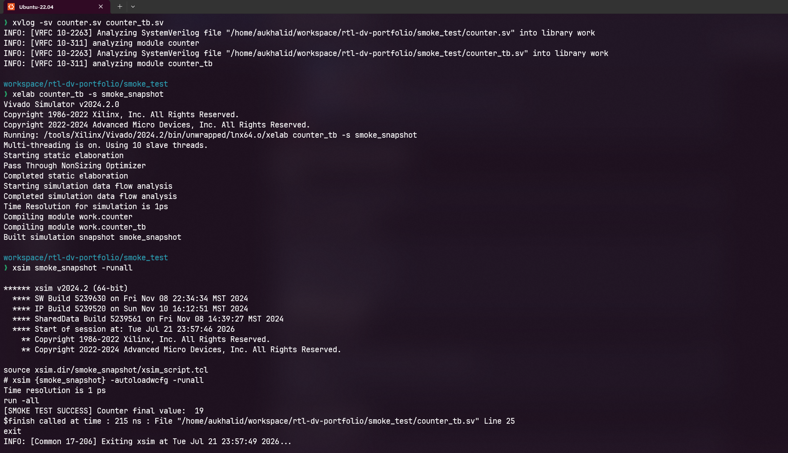

---

## Quick Reference Links

| Resource               | Link                                                                                                            |
| ---------------------- | --------------------------------------------------------------------------------------------------------------- |
| WSL Documentation      | [Microsoft Learn WSL](https://learn.microsoft.com/en-us/windows/wsl/)                                           |
| VMware Workstation Pro | [Download From Here](https://www.techpowerup.com/download/vmware-workstation-pro/)                              |
| Ubuntu 22.04.5 LTS ISO | [Ubuntu Releases](https://releases.ubuntu.com/22.04/)                                                           |
| Icarus Verilog Docs    | [Icarus Wiki](https://iverilog.fandom.com/wiki/Main_Page)                                                       |
| AMD Vivado ML Standard | [AMD Downloads](https://www.amd.com/en/support/downloads/adaptive-socs-and-fpgas/development-tools/2024-2.html) |
| Verible Releases       | [Chips Alliance GitHub](https://github.com/chipsalliance/verible/releases)                                      |

---

## Troubleshooting & Known Fixes

### Issue 1: Vivado Simulator (`xvlog`, `xelab`, `xsim`) Crashes with `std::runtime_error: locale`

#### Symptoms

When running Vivado tools inside a minimal Linux or WSL environment, execution aborts with errors such as:

```text
/bin/bash: warning: setlocale: LC_ALL: cannot change locale (en_US.UTF-8)
terminate called after throwing an instance of 'std::runtime_error'
  what(): locale::facet::_S_create_c_locale name not valid
```

#### Cause

Vivado's underlying C++ runtime engine strictly requires the `en_US.UTF-8` locale. Minimal Ubuntu images (especially WSL) do not include pre-compiled English locale binary databases by default.

#### Fix

```bash
# 1. Install locale packages and English language pack
sudo apt update
sudo apt install -y locales language-pack-en locales-all

# 2. Re-generate glibc locale binary database
sudo locale-gen en_US.UTF-8
sudo update-locale LANG=en_US.UTF-8 LC_ALL=en_US.UTF-8
sudo dpkg-reconfigure locales

# 3. Add exports to ~/.bashrc (if not already present)
echo 'export LANG=en_US.UTF-8' >> ~/.bashrc
echo 'export LC_ALL=en_US.UTF-8' >> ~/.bashrc

# 4. Reload active bash profile
source ~/.bashrc
```

---

### Issue 2: `chmod: changing permissions: Operation not permitted` on Windows Drives

#### Symptoms

Executing `chmod +x` on a file located in `/mnt/c/` throws a permission error:

```text
chmod: changing permissions of 'installer.bin': Operation not permitted
```

#### Cause

Windows NTFS filesystems mounted under `/mnt/c/` do not natively map POSIX execution permission flags to Linux binaries.

#### Fix

Copy the installer into your native Linux home directory before granting execution rights:

```bash
# Copy file from Windows storage to Linux Home
cp /mnt/c/Users/$USER/Downloads/your_installer.bin ~

# Navigate to Home and grant permissions
cd ~
chmod +x your_installer.bin
./your_installer.bin
```

### Issue 3: VS Code `Exec format error` in WSL2

**Error:**

```
/mnt/c/.../Code.exe: Exec format error
```

**Cause:** WSL's Interop service (`WSLInterop`) temporarily drops out. WSL uses this service to execute Windows `.exe` files from inside Linux, and when it drops, Linux treats `Code.exe` as an unrecognized binary.

---

#### Re-register the WSL Interop Service

Run this command in your WSL terminal to instantly re-enable Windows binary execution:

```bash
sudo tee /etc/systemd/system/wsl-interop-fix.service > /dev/null << 'EOF'
[Unit]
Description=Re-register WSLInterop binfmt handler
After=systemd-binfmt.service
Wants=systemd-binfmt.service

[Service]
Type=oneshot
ExecStart=/bin/bash -c 'echo ":WSLInterop:M::MZ::/init:PF" > /proc/sys/fs/binfmt_misc/register'
RemainAfterExit=yes

[Install]
WantedBy=multi-user.target
EOF

sudo systemctl daemon-reload
sudo systemctl enable wsl-interop-fix.service
sudo systemctl start wsl-interop-fix.service
```

Check:

```bash
ls /proc/sys/fs/binfmt_misc/
code .
```

---

#### Step 3: Full WSL Shutdown (Fallback)

If the commands above don't immediately clear it, the WSL VM kernel service simply needs a quick refresh:

1. Open **PowerShell** or **Command Prompt** in Windows _(not WSL)_.
2. Run:
   ```powershell
   wsl --shutdown
   ```
3. Re-open your WSL terminal and try `code .` again.

---

#### Quick One-Liner (Emergency Fix)

If you just need VS Code open _right now_ and don't want to reboot WSL:

```bash
sudo sh -c 'echo ":WSLInterop:M::MZ::/init:PF" > /proc/sys/fs/binfmt_misc/register' && code .
```

---

## Totally, Completely, Utterly OPTIONAL Nerdy Environment Setup

### Setup Goal

| Component | Choice                                 |
| --------- | -------------------------------------- |
| Terminal  | Windows Terminal                       |
| Shell     | Bash                                   |
| Font      | Cascadia Code                          |
| Prompt    | Starship                               |
| Theme     | Catppuccin Mocha                       |
| Tools     | Git, tmux, fzf, bat, eza, zoxide, btop |

---

### 1. Update Ubuntu

```bash
sudo apt update
sudo apt upgrade -y
```

---

### 2. Install Base Packages

```bash
sudo apt install -y \
git \
curl \
wget \
zip \
unzip \
build-essential \
tmux \
ripgrep \
fd-find \
btop
```

---

### 3. Install Starship

```bash
curl -sS https://raw.githubusercontent.com/starship/starship/master/install/install.sh | sh
```

Enable in Bash:

```bash
echo 'eval "$(starship init bash)"' >> ~/.bashrc
source ~/.bashrc
```

---

### 4. Install eza

```bash
sudo mkdir -p /etc/apt/keyrings

wget -qO- https://raw.githubusercontent.com/eza-community/eza/main/deb.asc | \
gpg --dearmor | sudo tee /etc/apt/keyrings/gierens.gpg >/dev/null

echo "deb [signed-by=/etc/apt/keyrings/gierens.gpg] http://deb.gierens.de stable main" | \
sudo tee /etc/apt/sources.list.d/gierens.list

sudo apt update
sudo apt install eza
```

---

### 5. Install zoxide

```bash
sudo apt update
sudo apt install zoxide
```

Enable:

```bash
echo 'eval "$(zoxide init bash)"' >> ~/.bashrc
source ~/.bashrc
```

---

### 6. Install fzf

```bash
sudo apt install -y fzf
```

---

### 7. Install bat

```bash
sudo apt install -y bat
```

Alias:

```bash
echo "alias cat='batcat'" >> ~/.bashrc
source ~/.bashrc
```

---

### 8. Git Configuration

```bash
git config --global init.defaultBranch main
git config --global pull.rebase false
git config --global color.ui auto
```

---

### Fonts

### Cascadia Code

Already included with Windows 11.

### JetBrains Mono Nerd Font

Install if you want terminal icons (Starship, eza, etc.).

Download from:

https://www.nerdfonts.com/font-downloads

Install all `.ttf` files and select **JetBrainsMono Nerd Font** in Windows Terminal.

---

### Recommended VS Code Extensions

- GitLens
- Error Lens
- Markdown All in One
- Material Icon Theme
- Catppuccin Theme

---

### Disable VS Code Restricted Mode (Optional)

Settings → Search **Workspace Trust**

Disable:

```
Security › Workspace › Trust: Enabled
```

Or add to `settings.json`:

```json
"security.workspace.trust.enabled": false
```

### Useful Bash Aliases

| Alias      | Expands To                           | Purpose                        |
| ---------- | ------------------------------------ | ------------------------------ |
| cls        | clear                                | Clear terminal                 |
| ..         | cd ..                                | Up one directory               |
| ...        | cd ../..                             | Up two directories             |
| ....       | cd ../../..                          | Up three directories           |
| home       | cd ~                                 | Go to home                     |
| ws         | cd ~/workspace                       | Go to workspace                |
| grep       | grep --color=auto                    | Colored grep output            |
| ls         | eza                                  | Modern ls                      |
| ll         | eza -lah                             | Detailed listing               |
| la         | eza -a                               | Show hidden files              |
| tree       | eza --tree                           | Tree view                      |
| cat        | batcat                               | Syntax-highlighted cat         |
| update     | sudo apt update && sudo apt upgrade  | Update system                  |
| install    | sudo apt install                     | Short apt install              |
| remove     | sudo apt remove                      | Short apt remove               |
| autoremove | sudo apt autoremove -y               | Remove unused packages         |
| c          | code .                               | Open current folder in VS Code |
| reload     | source ~/.bashrc                     | Reload Bash config             |
| h          | history                              | Show history                   |
| ports      | ss -tuln                             | Show listening ports           |
| dfh        | df -h                                | Disk usage                     |
| duh        | du -sh \*                            | Folder sizes                   |
| free       | free -h                              | Memory usage                   |
| psg        | ps aux \| grep                       | Search processes               |
| mkdirp     | mkdir -p                             | Create nested directories      |
| g          | git                                  | Git shortcut                   |
| gs         | git status                           | Git status                     |
| ga         | git add                              | Stage files                    |
| gaa        | git add .                            | Stage all                      |
| gc         | git commit                           | Commit                         |
| gcm        | git commit -m                        | Commit with message            |
| gp         | git push                             | Push                           |
| gpl        | git pull                             | Pull                           |
| gl         | git log --oneline --graph --decorate | Compact history                |
| gb         | git branch                           | List branches                  |
| gco        | git checkout                         | Checkout                       |
| gsw        | git switch                           | Switch branch                  |
| gd         | git diff                             | Diff                           |
| gr         | git restore                          | Restore file                   |
| cleanpyc   | find . -name "\*.pyc" -delete        | Remove pyc files               |

### Add all aliases

Open `~/.bashrc`:

```bash
nano ~/.bashrc
```

Append the following to the end of `~/.bashrc`:

```bash
# Navigation
alias clr='clear'
alias ..='cd ..'
alias ...='cd ../..'
alias ....='cd ../../..'
alias hm='cd ~'
alias ws='cd ~/workspace'
alias pj='cd ~/workspace/rtl-dv-projects'
alias cip='cd ~/workspace/rtl-dv-projects/sv-common-ip-library'

# File utilities
alias ls='eza'
alias ll='eza -lah'
alias la='eza -a'
alias tree='eza --tree'
alias cat='batcat'
alias grep='grep --color=auto'
alias md='mkdir -p'

# System
alias update='sudo apt update'
alias upgrade='sudo apt update && sudo apt upgrade'
alias install='sudo apt install'
alias remove='sudo apt remove'
alias autoremove='sudo apt autoremove -y'
alias ports='ss -tuln'
alias dfh='df -h'
alias duh='du -sh *'
alias free='free -h'
alias psg='ps aux | grep'

# VS Code
alias c='code .'
alias reload='source ~/.bashrc'
alias brc='nano ~/.bashrc'

# History
alias h='history'

# Git
alias g='git'
alias gs='git status'
alias ga='git add'
alias gaa='git add .'
alias gc='git commit'
alias gcm='git commit -m'
alias gp='git push'
alias gpl='git pull'
alias gl='git log --oneline --graph --decorate'
alias gb='git branch'
alias gco='git checkout'
alias gsw='git switch'
alias gd='git diff'
alias gr='git restore'
alias gcl='git clone'

# Misc
alias cleanpyc='find . -name "*.pyc" -delete'
```

Save and exit (Ctrl + O, Enter, Ctrl + X). Reload the bash engine:

```bash
source ~/.bashrc
```
