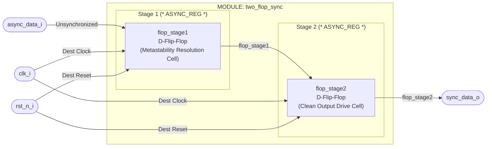

# Parameterized 2-Flip-Flop Synchronizer: Micro-Architecture & Verification Specification

## 1. Architectural Overview

The `two_flop_sync` is a parameterized, single/multi-bit Clock Domain Crossing (CDC) primitive IP designed to safely transfer asynchronous single-bit control flags or Gray-coded pointer vectors from a source clock domain (`src_clk`) into a destination clock domain (`clk_i`).

When an asynchronous signal transitions near the setup ($t_{\text{setup}}$) or hold ($t_{\text{hold}}$) window of a destination clock edge, the receiving flip-flop can enter a **metastable state**—a transient state where the output voltage hovers between logic '0' and logic '1'. The `two_flop_sync` mitigates this by passing the asynchronous signal through a cascading chain of two back-to-back flip-flops, providing an entire destination clock period ($T_{\text{clk}}$) for any metastable oscillation in the first stage (`flop_stage1`) to settle before being sampled by downstream logic (`flop_stage2` / `sync_data_o`).

In alignment with physical synthesis guidelines for ASIC/FPGA designs, stage registers are decorated with synthesis attributes (`(* ASYNC_REG = "TRUE" *)`) to enforce close physical placement in the layout, maximizing Mean Time Between Failures (MTBF). To ensure 100% IP portability across toolchains, the hardware interface uses pure, flat SystemVerilog ports with explicit direction/domain suffixes (`_i` for inputs, `_o` for outputs).

### Key Architectural Pillars

- **Metastability Mitigation & High MTBF:** Double-stage register sampling provides exponential growth in Mean Time Between Failures for CDC paths.
- **Physical Layout Synthesis Guard:** Natively incorporates `(* ASYNC_REG = "TRUE" *)` pragmas to instruct physical synthesis tools (e.g., AMD Vivado, Synopsys Design Compiler) to place synchronizer flip-flops in neighboring silicon slices/cells.
- **Parameterized Bus Sizing:** Supports synchronized vectors (`WIDTH`) and customizable reset states (`RESET_VAL`).
- **Isolated Formal SVA Watchdogs:** Includes SystemVerilog Assertions guarded by `` `ifdef SIMULATION `` to detect floating control signals and reset state violations without adding gate overhead.

---

## 2. Block & Waveform Diagrams

### 2.1 Micro-Architectural Block Diagram (ASCII)

```text
       +-----------------------------------------------------------------------------------+
       | MODULE: two_flop_sync                                                             |
       |                                                                                   |
       |  DESTINATION CLOCK DOMAIN (clk_i)                                                 |
       |                                                                                   |
       |                         +-------------------+       +-------------------+         |
       |                         | (* ASYNC_REG *)   |       | (* ASYNC_REG *)   |         |
       |                         |  flop_stage1      |       |  flop_stage2      |         |
       |                         |   Flip-Flop 1     |       |   Flip-Flop 2     |         |
       |                         +-------------------+       +-------------------+         |
       |                         |  D             Q  |       |  D             Q  |         |
------>| async_data_i [WIDTH-1:0] ==>|--->[Stage 1]----|======>|--->[Stage 2]----|========>| sync_data_o [WIDTH-1:0]
       |                         |                   |       |                   |         |
       |                         |  clk       rst_n  |       |  clk       rst_n  |         |
       |                         +----+---------+----+       +----+---------+----+         |
       |                              ^         ^                 ^         ^              |
       |                              |         |                 |         |              |
------>| clk_i -----------------------+---------|-----------------+---------|--------------|
------>| rst_n_i -------------------------------+---------------------------+--------------|
       |                                                                                   |
       +-----------------------------------------------------------------------------------+
```

### 2.2 Micro-Architectural Waveform Diagram (ASCII)

```text
               Cycle 0      Cycle 1      Cycle 2      Cycle 3      Cycle 4
               +----+       +----+       +----+       +----+       +----+
clk_i       ---|    |_______|    |_______|    |_______|    |_______|    |_______
               :            :            :            :            :
rst_n_i     ____________________________________________________________________
               :            :            :            :            :
               :   Asynchronous Edge     :            :            :
               :   (Un-aligned Transition)            :            :
async_data_i ______/------------\_______________________________________________
               :   :            :            :            :            :
flop_stage1 __________/==============\__________________________________________
(Stage 1)      :   : (May go    :            :            :            :
               :   :  Metastable)            :            :            :
flop_stage2 _______________________/==============\_____________________________
(Stage 2)      :   :            :  : (Clean Logic :            :            :
               :   :            :  :  Level)      :            :            :
sync_data_o _______________________/==============\_____________________________
               :            :      :              :            :            :
               <-----------><------>
                  Phase      Exact 2-Cycle Sync Latency
                  Offset    (Relative to Destination Clock Edge)
```

### 2.3 Mermaid Structural Architectural Diagram



---

## 3. Micro-Architectural Port & Parameter Specification

### 3.1 Compilation Parameters

| Parameter Name | Type                | Default Value | Description / Constraint                                                                                    |
| :------------- | :------------------ | :------------ | :---------------------------------------------------------------------------------------------------------- |
| `WIDTH`        | `int`               | `1`           | Bit-width of the vector being synchronized across clock domains.                                            |
| `RESET_VAL`    | `logic [WIDTH-1:0]` | `'0`          | Reset initial state vector assigned to `flop_stage1` and `flop_stage2` during active reset (`rst_n_i = 0`). |

### 3.2 Suffixed Signal Interface (Pinout)

| Signal Name    | Direction | Bit Width | Electrical Type | Domain       | Description                                                                                              |
| :------------- | :-------- | :-------- | :-------------- | :----------- | :------------------------------------------------------------------------------------------------------- |
| `clk_i`        | Input     | 1         | `logic`         | `clk_i`      | Destination Clock domain node. All internal synchronizer registers update on `clk_i` posedge.            |
| `rst_n_i`      | Input     | 1         | `logic`         | `clk_i`      | Destination Active-Low Reset. Asynchronously or synchronously resets intermediate stages to `RESET_VAL`. |
| `async_data_i` | Input     | `WIDTH`   | `logic`         | Asynchronous | Unsynchronized Input Signal originating from source clock domain or external async pin.                  |
| `sync_data_o`  | Output    | `WIDTH`   | `logic`         | `clk_i`      | Synchronized Clean Output Signal fully aligned with destination clock domain `clk_i`.                    |

---

## 4. Subsystem Operation & Timing Semantics

### 4.1 Clock Domain Crossing (CDC) Mechanism

1. **Unaligned Input Transition:** The input `async_data_i` transitions asynchronously relative to `clk_i`.

2. **Stage 1 Sampling (`flop_stage1`):** On the first rising edge of `clk_i` following the input transition, `flop_stage1` samples `async_data_i`. If the input changed within the setup/hold window, `flop_stage1` may experience a metastable event.

3. **Stage 2 Sampling (`flop_stage2`):** During the remaining clock period, the metastable node settles to a deterministic logic 0 or 1. On the second rising edge of `clk_i`, `flop_stage2` captures the resolved value from `flop_stage1`.

4. **Latency:** Total propagation latency is **2 destination clock edges** ($2 \times T_{\text{clk}_i}$).

### 4.2 Critical Usage Rules

- **Single-Bit or Gray-Coded Only:** Standard multi-bit binary values (`011` → `100`) **MUST NOT** be passed directly through multi-bit `two_flop_sync` instances without Gray encoding, as routing skews can cause multi-bit incoherence.

- **Minimum Pulse Width Constraint:** Incoming asynchronous pulses must remain high/low for at least $1.5 \times T_{\text{clk}_i}$ to guarantee sampling by `clk_i`.

---

## 5. Formal Protocol Verification (SVA Layer)

The SystemVerilog Assertions layer is integrated directly inside `` `ifdef SIMULATION `` guards:

| Assertion                   | Description                                                                                               |
| :-------------------------- | :-------------------------------------------------------------------------------------------------------- |
| `ASSERT_NO_X` (Reset Guard) | Monitors `rst_n_i` on `clk_i` posedge. If `rst_n_i` resolves to X or Z, a simulation exception is raised. |
| `p_reset_held`              | Ensures that while `rst_n_i` is active low (`1'b0`), `sync_data_o` holds its configured `RESET_VAL`.      |

---

## 6. Functional Verification & Definition of Done (DoD) Plan

### 6.1 Target Test Scenario Sequences (Tier 2 Plan)

| Test Scenario                          | Objective                                                                                                                                                                    |
| :------------------------------------- | :--------------------------------------------------------------------------------------------------------------------------------------------------------------------------- |
| **Reset Validation**                   | Assert `rst_n_i` low and verify `sync_data_o == RESET_VAL`.                                                                                                                  |
| **Directed Phase Offset Latency Test** | Drive an asynchronous pulse with an arbitrary time offset (e.g., `3.7ns`) relative to `clk_i`. Verify that `sync_data_o` updates after exactly 2 destination clock posedges. |
| **Randomized Phase & Vector Sweep**    | Drive 50 randomized input vectors with fractional time delays (`100 ps` to `8500 ps`) and verify clean propagation without protocol crashes.                                 |
