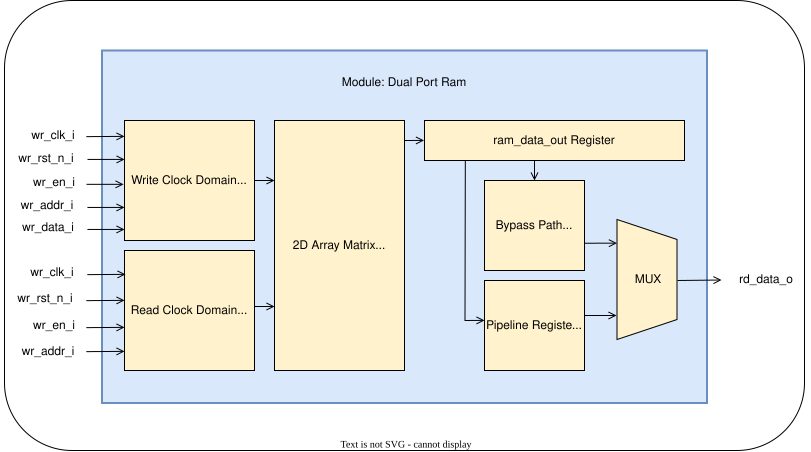

# Parameterized Dual-Clock Dual-Port RAM: Micro-Architecture & Verification Specification

## 1. Architectural Overview

The `dual_port_ram` is a highly robust, parameterizable, dual-clock synchronous memory block designed to serve as a core data-storage primitive across the silicon portfolio (e.g., cross-clock domain queues, frame buffers, and multi-clock FIFO memory arrays).

In alignment with physical foundry constraints, this module is engineered as a soft IP core that cleanly mirrors the operational behavior of industrial Foundry Simple Dual-Port Memory Compilers (such as TSMC or Intel hard macros) and FPGA Block RAM (BRAM) blocks. To maximize compatibility with downstream physical synthesis toolchains and automated layout generators, the hardware boundary utilizes traditional flat ports with explicit direction suffixes (`_i` for inputs, `_o` for outputs) and complete isolation from external package dependencies.

### Key Micro-Architectural Pillars

- **Asynchronous Dual-Clock Independence**: Completely decoupled Write Domain (`wclk_i`) and Read Domain (`rclk_i`) allowing independent clock frequencies and phase offsets without setup/hold racing on control logic.
- **Pure Standalone Port Portability**: Self-contained module definition with zero package dependencies, ensuring instant portability across ASIC/FPGA synthesis tools.
- **Optional Pipeline Registers**: Includes a parameter-controlled output stage (`OUT_REG`) on the read clock domain to optimize the critical timing path (clock-to-output latency) during physical chip synthesis.
- **Embedded Formal Verification Layer**: Deploys a clean, non-intrusive SystemVerilog Assertion (SVA) protocol watchdog layer guarded by `` `ifdef SIMULATION `` to ensure zero synthesis area overhead.

---

## 2. Block Diagram & Structural Layout

The operational block diagram highlights the isolation between the dual-clock synthesizable memory logic core and the external assertion probe layer:

---

## 3. Micro-Architectural Port & Parameter Specification

### 3.1 Compilation Parameters

| Parameter Name | Type  | Default Value | Description / Constraint                                                                                                                                   |
| :------------- | :---- | :------------ | :--------------------------------------------------------------------------------------------------------------------------------------------------------- |
| `DATA_WIDTH`   | `int` | `32`          | Total data bit-width per individual memory word. Limits maximum parallel bus sizing.                                                                       |
| `ADDR_WIDTH`   | `int` | `8`           | Address bus width. Governs total memory depth matrix mathematically via formula: $2^{ADDR\_WIDTH}$.                                                        |
| `OUT_REG`      | `bit` | `1'b0`        | Output pipeline selector configuration. `0` = Flow-through output path (1 cycle latency); `1` = Pipelined registered data stage output (2 cycles latency). |

### 3.2 Suffixed Signal Interface (Pinout)

| Signal Name | Direction | Bit Width    | Electrical Type | Domain   | Description                                                                                                    |
| :---------- | :-------- | :----------- | :-------------- | :------- | :------------------------------------------------------------------------------------------------------------- |
| `wclk_i`    | Input     | 1            | `logic`         | `wclk_i` | Write Domain Clock node. All internal memory writes occur on the synchronous rising edge of `wclk_i`.          |
| `wrst_n_i`  | Input     | 1            | `logic`         | `wclk_i` | Active-low reset for write domain logic.                                                                       |
| `wr_en_i`   | Input     | 1            | `logic`         | `wclk_i` | Synchronous write enable control flag. High = Write operation active; Low = Idle.                              |
| `waddr_i`   | Input     | `ADDR_WIDTH` | `logic`         | `wclk_i` | Decoded write address bus select vector pointing to target word matrix location array.                         |
| `wr_data_i` | Input     | `DATA_WIDTH` | `logic`         | `wclk_i` | Incoming parallel write data payload bus written to selected write address slot.                               |
| `rclk_i`    | Input     | 1            | `logic`         | `rclk_i` | Read Domain Clock node. All internal memory reads and pipeline transfers occur on the rising edge of `rclk_i`. |
| `rrst_n_i`  | Input     | 1            | `logic`         | `rclk_i` | Active-low reset for read output pipelines; clears output registers without erasing core matrix data fields.   |
| `rd_en_i`   | Input     | 1            | `logic`         | `rclk_i` | Synchronous read enable control flag. High = Read operation active; Low = Output holds previous state.         |
| `raddr_i`   | Input     | `ADDR_WIDTH` | `logic`         | `rclk_i` | Decoded read address bus select vector pointing to target word matrix location array.                          |
| `rd_data_o` | Output    | `DATA_WIDTH` | `logic`         | `rclk_i` | Synchronous outgoing data payload bus driven back to requesting read domain master.                            |

---

## 4. Subsystem Operation & Multi-Clock Timing Semantics

### 4.1 Asynchronous Multi-Clock Execution

Write and read operations execute concurrently across completely independent clock networks:

- **Write Operations (`wclk_i` Domain)**: When `wr_en_i` is driven high on the rising edge of `wclk_i`, the incoming payload `wr_data_i` is committed to `mem_core[waddr_i]`.
- **Read Operations (`rclk_i` Domain)**: When `rd_en_i` is driven high on the rising edge of `rclk_i`, the array slot `mem_core[raddr_i]` is sampled into the read data output path.

### 4.2 Pipeline Latency Analysis (`OUT_REG`)

The read data availability timing varies dynamically based on the configured `OUT_REG` pipeline configuration parameter:

#### Mode A: Unregistered Flow-Through (`OUT_REG = 0`)

- **Description**: The read array sampling register directly feeds the output port multiplexer.
- **Timing Effect**: Reading requires **1 cycle latency** relative to `rclk_i`. Data sampled on `rclk_i` edge $N$ is valid on `rd_data_o` prior to edge $N+1$.

#### Mode B: Registered Output Pipeline (`OUT_REG = 1`)

- **Description**: An extra pipeline register stage (`ram_data_reg`) is inserted on the read output path to break long output wire capacitance paths during ASIC place-and-route.
- **Timing Effect**: Reading requires **2 cycles latency** relative to `rclk_i`. Data sampled on `rclk_i` edge $N$ appears on `rd_data_o` after edge $N+2$.

---

## 5. Formal Protocol Verification (SVA Layer)

To optimize synthesis and preserve structural readability, the SystemVerilog Assertions layer is integrated directly within `` `ifdef SIMULATION `` guards.

### 5.1 Formal Check Assertions Matrix

| Assertion                            | Description                                                                                                                                                                                                                      |
| :----------------------------------- | :------------------------------------------------------------------------------------------------------------------------------------------------------------------------------------------------------------------------------- |
| `ASSERT_NO_X` (Write & Read Enables) | Evaluates `wr_en_i` on `wclk_i` and `rd_en_i` on `rclk_i`. If either control line transitions into an uninitialized floating condition (X or Z logic state), a simulation protocol exception is flagged immediately.             |
| `p_stable_waddr_during_write`        | A concurrent implication check ($A \mapsto B$) on `wclk_i`. Ensures that whenever `wr_en_i` is active (`1'b1`), the `waddr_i` line bits are fully deterministic (`!$isunknown(waddr_i)`), blocking unintended memory corruption. |
| `p_no_x_wdata_during_write`          | Ensures that whenever an active write cycle triggers on `wclk_i`, the target incoming `wr_data_i` payload vector contains zero corrupt floating bits.                                                                            |
| `p_stable_raddr_during_read`         | Ensures that whenever `rd_en_i` is active (`1'b1`) on `rclk_i`, the `raddr_i` line bits contain zero floating X/Z states.                                                                                                        |

---

## 6. Functional Verification & Definition of Done (DoD) Plan

### 6.1 Target Test Scenario Sequences

| Test Scenario                                      | Objective                                                                                                                                                                                                       |
| :------------------------------------------------- | :-------------------------------------------------------------------------------------------------------------------------------------------------------------------------------------------------------------- |
| **Reset Validation**                               | Assert `rrst_n_i` randomly during execution streams. Verify that `rd_data_o` snaps to a uniform zero state immediately on the subsequent `rclk_i` cycle while ensuring background data remains safely retained. |
| **Asynchronous Clock Frequency Ratios**            | Run concurrent write and read operations across non-integer clock frequency ratios (e.g., $100\text{ MHz}$ `wclk_i` vs $143.5\text{ MHz}$ `rclk_i`) to verify cross-domain immunity.                            |
| **Concurrent Read/Write Non-Colliding Operations** | Push simultaneous writes to address `0x0A` on `wclk_i` while reading from address `0x0B` on `rclk_i`. Validate that both transactions complete cleanly without data corruption.                                 |
| **Corner Boundary Operations**                     | Execute memory transactions at the absolute lowest address boundary (`0x00`) and the maximum upper threshold value limit ($2^{ADDR\_WIDTH}-1$) to test against accidental address truncation.                   |
| **Randomized Stress Traffic Loops**                | Fire high-density randomized bursts of read/write commands over 10,000 simulation clocks to drive the structural verification scoreboard metrics.                                                               |
